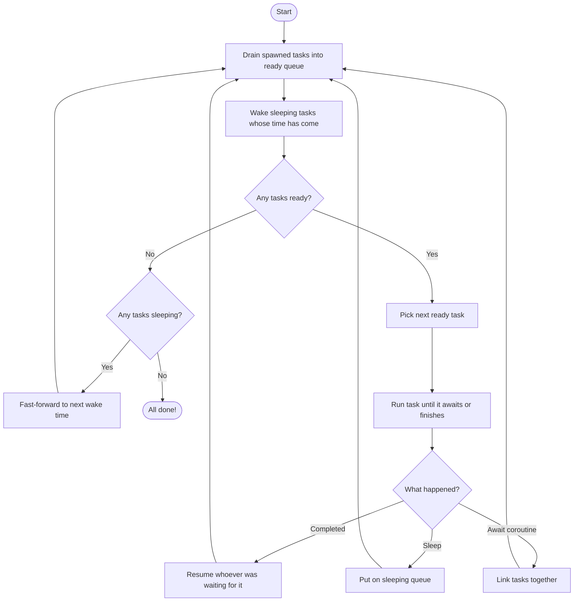
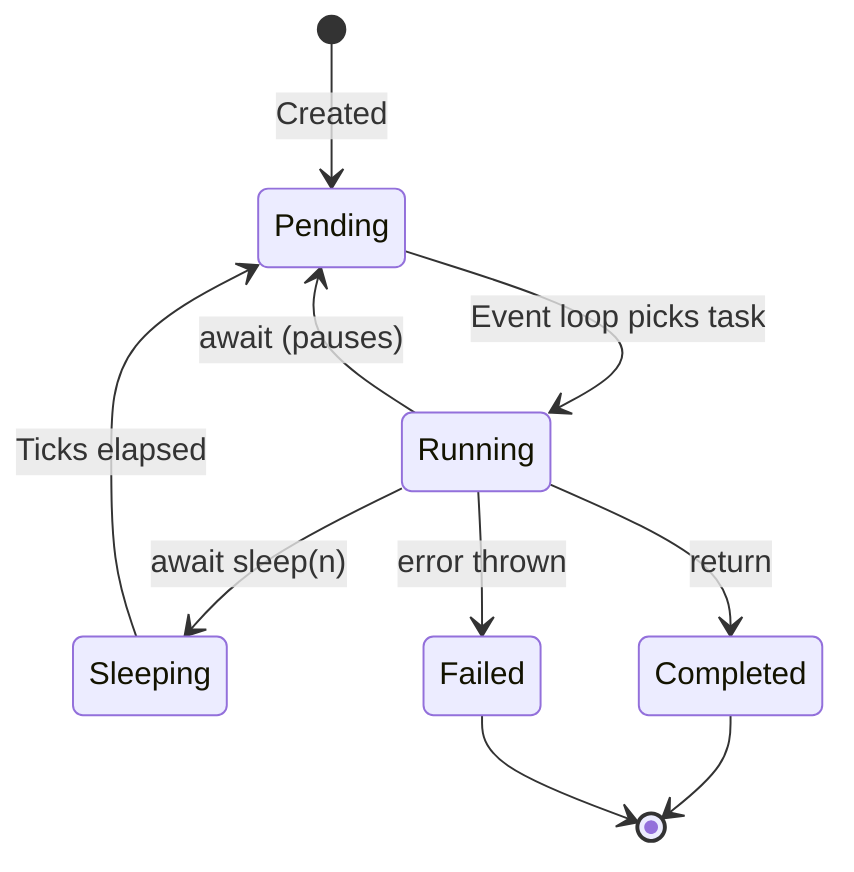

# Async / Await

## The Restaurant Kitchen

!!! note
    This page builds on [Functions](functions.md) and
    [Iterators & Generators](iterators.md). Read those first if you
    haven't already.

Imagine a restaurant kitchen with one chef (the **event loop**) and
several dishes to prepare (the **tasks**):

- The chef starts chopping vegetables for soup.
- While the soup **simmers** (waits), the chef doesn't just stand there
  -- they start making a salad.
- When the salad needs dressing from the fridge (another wait), the chef
  checks if the soup is ready.
- The chef keeps switching between dishes whenever one needs to wait.

This is **cooperative concurrency** -- tasks voluntarily give up control
at `await` points, letting other tasks make progress. Nobody is forced
to stop; each task politely says *"I'm waiting, go ahead"*.

## Async Functions

An **async function** is declared with `async fn`. It looks like a
regular function, but it can use `await` to pause:

```pebble
async fn make_soup() {
    print("chopping vegetables")
    await sleep(3)
    print("soup is ready!")
    return "soup"
}
```

When you **call** an async function, it doesn't run the code right away.
Instead, it gives you back a **coroutine object** -- a recipe card that
the event loop will follow later:

```pebble
let c = make_soup()
print(type(c))    // "coroutine"
```

## Running Coroutines with `async_run`

A coroutine won't do anything on its own -- you need the chef (event
loop) to start cooking! The `async_run` builtin hands a coroutine to
the event loop and waits for it to finish:

```pebble
async fn greet() {
    return "hello"
}

let result = async_run(greet())
print(result)    // "hello"
```

Think of `async_run` as opening the kitchen for the day. It starts the
event loop, runs your main task, and returns the result when everything
is done.

## Await -- Waiting for a Result

Inside an async function, `await` pauses the current task until another
coroutine finishes (or a sleep completes):

```pebble
async fn fetch_data() {
    await sleep(2)
    return 42
}

async fn main() {
    let value = await fetch_data()
    print(value)    // 42
}

async_run(main())
```

When `main` hits `await fetch_data()`, it:

1. Starts running `fetch_data`
2. Pauses `main` until `fetch_data` returns
3. Gives `main` the return value (42)

This is like the chef saying *"I need this sauce finished before I can
plate the dish -- let me work on the sauce first."*

## Spawn -- Starting Background Tasks

What if you want multiple tasks running at the same time? The `spawn`
builtin registers a coroutine with the event loop and gives you back a
**handle** you can `await` later:

```pebble
async fn task_a() {
    print("a start")
    await sleep(2)
    print("a done")
}

async fn task_b() {
    print("b start")
    await sleep(1)
    print("b done")
}

async fn main() {
    let ha = spawn(task_a())
    let hb = spawn(task_b())
    await ha
    await hb
}

async_run(main())
```

Output:

```
a start
b start
b done
a done
```

Here's what happens step by step:

1. `main` spawns both tasks -- neither runs yet, they're just
   registered with the kitchen.
2. `main` hits `await ha` and pauses.
3. The event loop picks `task_a` -- it prints "a start" and sleeps for
   2 ticks.
4. The event loop picks `task_b` -- it prints "b start" and sleeps for
   1 tick.
5. After 1 tick, `task_b` wakes up and prints "b done".
6. After 2 ticks, `task_a` wakes up and prints "a done".

Because `task_b` sleeps for fewer ticks, it finishes first -- even
though `task_a` was spawned first!

## Sleep -- Simulated Waiting

`sleep(ticks)` makes the current task pause for a number of **ticks**
(time steps). While one task sleeps, the event loop runs other tasks:

```pebble
async fn countdown(name, n) {
    let i = n
    while i > 0 {
        print(name + ": " + str(i))
        await sleep(1)
        i = i - 1
    }
    print(name + ": done!")
}

async fn main() {
    let h1 = spawn(countdown("A", 3))
    let h2 = spawn(countdown("B", 2))
    await h1
    await h2
}

async_run(main())
```

The event loop alternates between A and B each tick, so you see output
interleaved rather than one finishing before the other starts.

## How the Event Loop Works



The event loop is like a chef checking a to-do list:

1. **Check for new orders** -- any newly spawned tasks?
2. **Check the timers** -- any sleeping tasks ready to wake up?
3. **Pick a task** -- grab the next one from the ready queue.
4. **Work on it** -- run until it pauses (`await`) or finishes.
5. **Handle the result** -- completed? sleeping? waiting on another
   task? Route it to the right place.
6. **Repeat** until all tasks are done.

## Task State Machine



Every coroutine starts as **pending**. The event loop picks it up and
runs it. At an `await`, it goes back to pending (or sleeping). When
it returns a value, it's **completed**. If something goes wrong, it's
**failed**.

## Async vs Generators -- What's the Difference?

Both generators and async functions can pause and resume, but they serve
different purposes:

| Feature | Generators | Async Functions |
|---------|-----------|-----------------|
| Keyword | `yield` | `await` |
| Purpose | Produce a sequence of values | Run tasks concurrently |
| Who resumes? | `next()` or `for` loop | Event loop |
| Returns | One value at a time | One final result |
| Uses | Lazy sequences, infinite lists | I/O, timers, parallelism |

You **cannot** mix them -- using `yield` inside an `async fn` (or
`await` inside a regular `fn`) is an error.

## Error Handling

If an async function throws an error, it propagates through `await`:

```pebble
async fn risky() {
    throw "something went wrong"
}

async fn main() {
    try {
        await risky()
    } catch e {
        print("caught: " + e)
    }
}

async_run(main())
// prints: caught: something went wrong
```

If an error is not caught, it propagates out of `async_run` just like a
normal function error.

## Rules and Restrictions

1. `await` can only appear inside an `async fn`.
2. `yield` cannot appear inside an `async fn`.
3. `async_run` expects a coroutine object, not a regular value.
4. `spawn` expects a coroutine object.
5. `sleep` expects an integer (the number of ticks).

## Under the Hood

When the compiler sees `async fn`, it compiles the function body the
same way as a regular function but marks the code object with
`is_async = True`. When the VM calls an async function, instead of
executing the body, it creates a `CoroutineObject` -- a snapshot of the
function ready to run later.

The `AWAIT` bytecode instruction saves the current coroutine's state
(instruction pointer, variables, closure cells) and hands control back
to the event loop, just like `YIELD` does for generators.

The event loop lives inside the VM. It maintains two queues:

- **Ready queue** -- tasks that can run right now (round-robin order).
- **Sleeping heap** -- tasks waiting for their tick count to arrive
  (sorted by wake time).

Each iteration, the loop picks one ready task, runs it until it hits an
`await` or finishes, then routes it to the appropriate queue. When all
tasks are done, the loop returns the main task's result.
