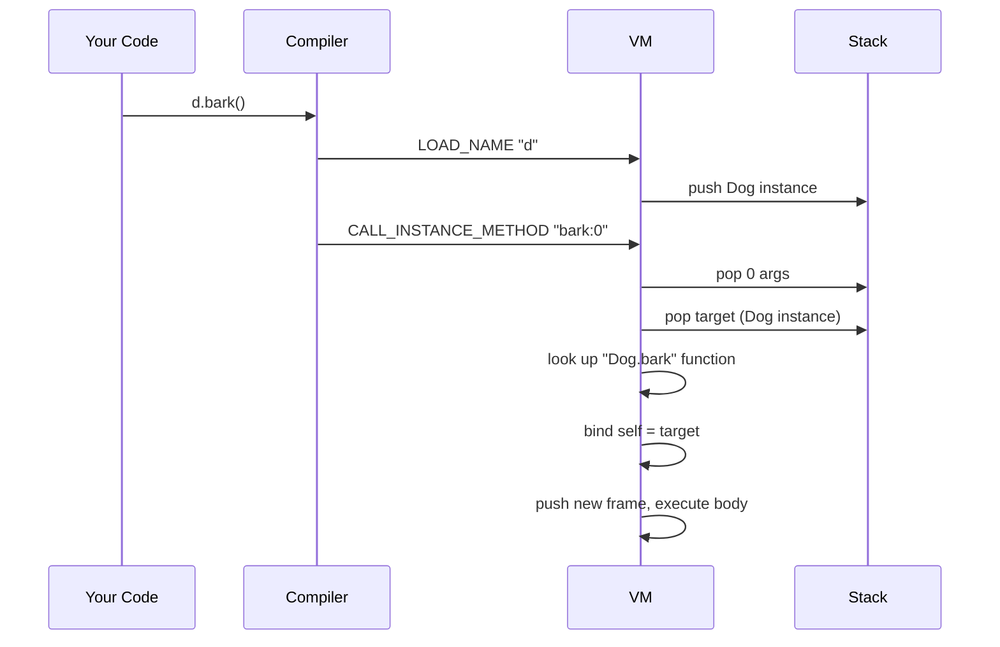

# Classes

## The Blueprint That Does Things

In [Structs](structs.md) we built custom boxes with labeled
compartments -- like a LEGO car with slots for **color**, **speed**,
and **name**. But what if you wanted the car to *drive*? Or *honk*?
A struct can hold data, but it can't **do** anything with it.

A **class** is like a struct that has learned some tricks. It has
fields (the labeled compartments) **and** methods (things it knows
how to do). Think of a class as a blueprint that includes both the
*parts list* and the *instruction manual*.

## Defining a Class

Use the `class` keyword followed by a name, then list the fields and
methods inside curly braces:

```pebble
class Dog {
    name,
    age,

    fn bark(self) {
        print("Woof! My name is " + self.name)
    }

    fn birthday(self) {
        self.age = self.age + 1
    }
}
```

The fields come first (comma-separated, just like struct fields),
and then the methods (defined with `fn`, just like regular functions).

## The `self` Parameter

Every method must have `self` as its **first parameter**. This is
how the method knows *which* instance it belongs to.

When you call `myDog.bark()`, Pebble automatically passes `myDog` as
`self`. You don't type `self` in the call -- Pebble handles it for
you. Inside the method, `self.name` means "the `name` field of
whichever dog called this method."

Think of `self` as a mirror. When the dog looks in the mirror, it
sees *itself* -- its own name, its own age, its own data.

## Creating Instances

You create a class instance the same way you create a struct -- call
the class name like a function, passing one value for each field:

```pebble
let rex = Dog("Rex", 3)
let luna = Dog("Luna", 5)
```

The arguments are **positional** -- the first value fills the first
field, the second value fills the second field, and so on. If you
pass the wrong number of arguments, Pebble catches the mistake
before your program runs.

## Calling Methods

Use a dot (`.`) followed by the method name and parentheses:

```pebble
rex.bark()       # prints: Woof! My name is Rex
luna.bark()      # prints: Woof! My name is Luna
```

Even though both dogs use the same `bark` method, each one sees its
own data through `self`. Rex's `self.name` is `"Rex"`, while Luna's
`self.name` is `"Luna"`.

## Methods That Change Things

Methods can modify the instance's fields using `self.field = value`:

```pebble
print(rex.age)    # prints: 3
rex.birthday()
print(rex.age)    # prints: 4
```

The `birthday` method changed Rex's age, but Luna's age stays the
same. Each instance is independent.

## Methods with Extra Parameters

Methods can take additional parameters beyond `self`:

```pebble
class Calculator {
    value,

    fn add(self, n) {
        self.value = self.value + n
    }

    fn multiply(self, n) {
        self.value = self.value * n
    }
}

let calc = Calculator(0)
calc.add(10)
calc.multiply(3)
print(calc.value)   # prints: 30
```

When calling `calc.add(10)`, Pebble passes `calc` as `self` and `10`
as `n`. You only write the extra arguments in the call.

## Methods That Return Values

Methods can return values just like regular functions:

```pebble
class Rectangle {
    width,
    height,

    fn area(self) -> Int {
        return self.width * self.height
    }

    fn is_square(self) -> Bool {
        return self.width == self.height
    }
}

let r = Rectangle(4, 6)
print(r.area())       # prints: 24
print(r.is_square())  # prints: false
```

## Type Annotations on Methods

Method parameters and return types can have type annotations, just
like regular functions:

```pebble
class Greeter {
    name: String,

    fn greet(self, greeting: String) -> String {
        return greeting + ", " + self.name + "!"
    }
}

let g = Greeter("Alice")
print(g.greet("Hello"))   # prints: Hello, Alice!
```

Fields can have type annotations too -- they work the same way as
struct field annotations.

## Structs vs Classes

Pebble has both `struct` and `class`. Here's when to use each:

| Feature | Struct | Class |
|---------|--------|-------|
| Fields | Yes | Yes |
| Methods | No | Yes |
| Use when... | You just need to group data | Your data needs to *do things* |

Think of it this way:

- A **struct** is a **form** -- it has blanks to fill in, but it
  doesn't do anything on its own. Like an address card with name,
  street, and city.
- A **class** is a **robot** -- it has data *and* it knows how to
  act on that data. Like a calculator that holds a number and can
  add, subtract, or multiply.

Both structs and classes create instances the same way (`Name(args)`),
and both support field access (`inst.field`) and field mutation
(`inst.field = value`).

## Error Cases

Pebble catches class-related mistakes early:

```pebble
# Method missing self parameter
class Bad {
    fn do_thing() { }          # Error: first parameter must be 'self'
}

# Wrong number of constructor arguments
let d = Dog("Rex")             # Error: expects 2 arguments, got 1

# Calling a method that doesn't exist
d.fly()                        # Error: Class 'Dog' has no method 'fly'

# Calling a method on a non-class value
let x = 42
x.bark()                       # Error: not a struct

# Duplicate field names
class Bad { x, x }             # Error: Duplicate field 'x'

# Duplicate method names
class Bad {
    fn go(self) { }
    fn go(self) { }            # Error: Duplicate method 'go'
}
```

## Practical Examples

### Counter

```pebble
class Counter {
    count,

    fn increment(self) {
        self.count = self.count + 1
    }

    fn reset(self) {
        self.count = 0
    }

    fn get(self) -> Int {
        return self.count
    }
}

let c = Counter(0)
c.increment()
c.increment()
c.increment()
print(c.get())   # prints: 3
c.reset()
print(c.get())   # prints: 0
```

### Bank Account

```pebble
class Account {
    owner,
    balance,

    fn deposit(self, amount) {
        self.balance = self.balance + amount
    }

    fn withdraw(self, amount) {
        self.balance = self.balance - amount
    }

    fn summary(self) -> String {
        return self.owner + ": $" + str(self.balance)
    }
}

let acc = Account("Alice", 100)
acc.deposit(50)
acc.withdraw(30)
print(acc.summary())   # prints: Alice: $120
```

### Game Character

```pebble
class Player {
    name,
    hp,
    score,

    fn take_damage(self, amount) {
        self.hp = self.hp - amount
    }

    fn earn_points(self, points) {
        self.score = self.score + points
    }

    fn is_alive(self) -> Bool {
        return self.hp > 0
    }
}

let hero = Player("Knight", 100, 0)
hero.earn_points(50)
hero.take_damage(30)
print(hero.hp)          # prints: 70
print(hero.is_alive())  # prints: true
```

## How It Works Under the Hood

### Defining a Class

When the compiler sees a class definition, it does two things:

1. **Stores field metadata** -- same as structs. The class name and
   ordered field list go into the struct registry so the VM knows
   how to construct instances.
2. **Compiles each method as a function** -- with a special mangled
   name. The method `bark` in class `Dog` becomes a function called
   `"Dog.bark"`. This lets Pebble reuse its entire existing function
   machinery -- no special "method frame" needed.

### Constructing an Instance

Class instances are created exactly like struct instances. When the
VM sees `CALL "Dog"`, it checks the struct registry, pops the field
values, and builds a `StructInstance`. No new opcode needed -- classes
and structs share the same construction path.

### Calling a Method

When you write `d.bark()`, the compiler emits a special instruction:

```
LOAD_NAME "d"
CALL_INSTANCE_METHOD "bark:0"
```

The operand `"bark:0"` encodes two things: the method name (`bark`)
and the number of extra arguments (`0`).

The VM then:

1. Pops the arguments (if any) from the stack
2. Pops the target instance (`d`)
3. Looks up `"Dog.bark"` in the function registry
4. Creates a new frame with `self` bound to `d`
5. Executes the method body

Here's the flow as a diagram:



### Why Not Reuse CALL_METHOD?

Pebble already has a `CALL_METHOD` opcode for built-in methods like
`push()` on lists or `upper()` on strings. Those built-in methods
have fixed arities and use a special padding scheme on the stack.

User-defined class methods can have any number of parameters, so
Pebble uses a separate `CALL_INSTANCE_METHOD` opcode with a simpler
design. This keeps both paths clean and avoids mixing concerns.

## Summary

| Syntax | What it does |
|--------|-------------|
| `class Name { fields, fn method(self) { } }` | Define a class with fields and methods |
| `Name(a, b)` | Create an instance (same as structs) |
| `inst.method()` | Call a method on an instance |
| `self.field` | Read a field inside a method |
| `self.field = expr` | Write a field inside a method |
| `CALL_INSTANCE_METHOD "name:n"` | VM instruction: call a class method with n args |
