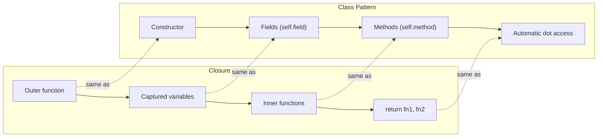

# Closures as Classes

## Build-a-Robot Two Ways

You already know two powerful Pebble features:

- [**Closures**](closures.md) -- functions that carry a backpack of
  variables from where they were created.
- [**Classes**](classes.md) -- blueprints that bundle data (fields) and
  behaviour (methods) into one neat package.

Here's a secret: **closures and classes can do the same job.** You can
build an "object" -- something with private state and actions -- using
*either* tool.

Imagine you want to build a robot that counts things. You have two
options:

- **Way 1 (closures):** Put the counter in a backpack, then hand-write
  an instruction card for each trick (increment, reset, read the count).
- **Way 2 (classes):** Use a robot-building kit with a labeled
  compartment for the counter and a printed instruction manual.

Both robots work exactly the same from the outside. The kit version is
just easier to read, share, and extend.

Let's see this in action with three examples.

## Example 1: A Counting Robot

### The Closure Way

```pebble
fn make_counter() {
    let count = 0

    fn increment() {
        count = count + 1
    }

    fn get_count() {
        return count
    }

    fn reset() {
        count = 0
    }

    return increment, get_count, reset
}

let inc, get, rst = make_counter()
inc()
inc()
inc()
print(get())   # prints: 3
rst()
print(get())   # prints: 0
```

The outer function `make_counter` creates a `count` variable. Three
inner functions -- `increment`, `get_count`, and `reset` -- all capture
that variable in their backpacks. We return all three and unpack them
into separate names.

### The Class Way

```pebble
class Counter {
    count,

    fn increment(self) {
        self.count = self.count + 1
    }

    fn get(self) {
        return self.count
    }

    fn reset(self) {
        self.count = 0
    }
}

let c = Counter(0)
c.increment()
c.increment()
c.increment()
print(c.get())   # prints: 3
c.reset()
print(c.get())   # prints: 0
```

### What's the Same?

Both versions:

- Store a number (`count`) that only the "object" can see
- Provide `increment`, `get`/`get_count`, and `reset` operations
- Keep state between calls -- incrementing three times gives 3
- Create **independent** instances -- calling `make_counter()` twice
  (or `Counter(0)` twice) gives two separate counters

The only difference is how you *talk to* the object:

| | Closure | Class |
|---|---|---|
| Create | `let inc, get, rst = make_counter()` | `let c = Counter(0)` |
| Use | `inc()` | `c.increment()` |
| Read | `get()` | `c.get()` |
| Reset | `rst()` | `c.reset()` |

The class version is shorter and the dot syntax (`c.increment()`) makes
it clear that `increment` belongs to `c`.

## Example 2: A Dog That Knows Tricks

### The Closure Way

```pebble
fn make_dog(name) {
    let the_name = name

    fn bark() {
        return "Woof! I'm " + the_name
    }

    fn rename(new_name) {
        the_name = new_name
    }

    fn get_name() {
        return the_name
    }

    return bark, rename, get_name
}

let bark, rename, get_name = make_dog("Rex")
print(bark())       # prints: Woof! I'm Rex
rename("Buddy")
print(bark())       # prints: Woof! I'm Buddy
```

Notice that the parameter `name` is copied into `the_name` so the
closure can capture and change it.

### The Class Way

```pebble
class Dog {
    name,

    fn bark(self) {
        return "Woof! I'm " + self.name
    }

    fn rename(self, new_name) {
        self.name = new_name
    }
}

let d = Dog("Rex")
print(d.bark())       # prints: Woof! I'm Rex
d.rename("Buddy")
print(d.bark())       # prints: Woof! I'm Buddy
```

### What Changed?

With the class version:

- No need to manually copy `name` into `the_name`
- `self.name` reads and writes the field directly
- `rename` takes the new name as a method argument (with `self`
  handled automatically)
- You can also read the name directly: `print(d.name)`

## Example 3: A Stack

A **stack** is a data structure where the last item added is the first
one removed -- like a stack of plates.

### The Closure Way

```pebble
fn make_stack() {
    let items = []

    fn stack_push(val) {
        push(items, val)
    }

    fn stack_pop() {
        return pop(items)
    }

    fn peek() {
        return items[len(items) - 1]
    }

    fn is_empty() {
        return len(items) == 0
    }

    return stack_push, stack_pop, peek, is_empty
}

let push_fn, pop_fn, peek_fn, empty_fn = make_stack()
print(empty_fn())    # prints: true
push_fn(10)
push_fn(20)
push_fn(30)
print(peek_fn())     # prints: 30
print(pop_fn())      # prints: 30
print(pop_fn())      # prints: 20
print(empty_fn())    # prints: false
```

### The Class Way

```pebble
class Stack {
    items,

    fn stack_push(self, val) {
        push(self.items, val)
    }

    fn stack_pop(self) {
        return pop(self.items)
    }

    fn peek(self) {
        return self.items[len(self.items) - 1]
    }

    fn is_empty(self) {
        return len(self.items) == 0
    }
}

let s = Stack([])
print(s.is_empty())    # prints: true
s.stack_push(10)
s.stack_push(20)
s.stack_push(30)
print(s.peek())        # prints: 30
print(s.stack_pop())   # prints: 30
print(s.stack_pop())   # prints: 20
print(s.is_empty())    # prints: false
```

### The Pattern

By now you can probably see the pattern. Every closure-based "object"
follows the same recipe:

1. An outer function creates local variables (the **state**)
2. Inner functions read and modify that state (the **methods**)
3. The outer function returns the inner functions (the **interface**)

A class does the exact same thing, just with nicer syntax.

## The Equivalence

Here's a diagram showing how each part of the closure pattern maps to
its class equivalent:



And as a table:

| Closure pattern | Class equivalent |
|---|---|
| Outer function | Constructor |
| Captured variables | Fields (`self.field`) |
| Inner functions | Methods (`self.method()`) |
| `return fn1, fn2` | Automatic dot access |
| Each call = new state | Each instance = new state |

## Where Closures Fall Short

If closures can do the same job, why bother with classes? Because
classes give you things closures can't:

1. **Identity** -- `type(my_dog)` returns `"Dog"` for a class instance,
   but `type(bark)` just returns `"fn"`. Classes know *what they are*.

2. **Inheritance** -- A `Puppy` class can
   [extend](inheritance.md) `Dog` and inherit all its methods.
   Closures have no way to "extend" another closure.

3. **Operator overloading** -- Classes can define
   [custom operators](operator-overloading.md) like `+` or `==`.
   Closures can't.

4. **Dot syntax** -- With a class, you write `s.stack_push(10)`. With
   closures, you have to unpack each method into its own variable:
   `let push_fn, pop_fn, peek_fn, empty_fn = make_stack()`.

5. **Inspectability** -- You can print a class instance and see its
   fields: `Dog(name=Rex, age=3)`. A closure's captured state is
   hidden.

## So Why Learn This?

If classes are better, why show the closure version at all?

Because understanding **how** something works makes you a better
programmer. When you see that a class is really just closures with
extra convenience, you understand:

- **Classes aren't magic** -- they're a pattern you could build
  yourself.
- **Closures are powerful** -- they can create private state, just
  like objects.
- **Syntactic sugar matters** -- the same idea expressed with cleaner
  syntax is easier to read, debug, and share.

In many real languages (like JavaScript), people used exactly this
closure pattern before classes were added to the language. Understanding
both sides helps you read code in any language.

## Summary

| Feature | Closure version | Class version |
|---|---|---|
| Private state | Captured variables | Fields |
| Behaviour | Inner functions | Methods |
| Create instance | Call outer function | Call constructor |
| Access methods | Unpack into variables | Dot syntax |
| Identity (`type()`) | `"fn"` | Class name |
| Inheritance | Not possible | `extends` keyword |
| Operator overloading | Not possible | `__add__`, `__str__`, etc. |
| Inspectability | Hidden state | `print(instance)` shows fields |

**Bottom line:** Closures and classes are two sides of the same coin.
Classes are syntactic sugar that makes the closure pattern cleaner,
more readable, and more powerful.
