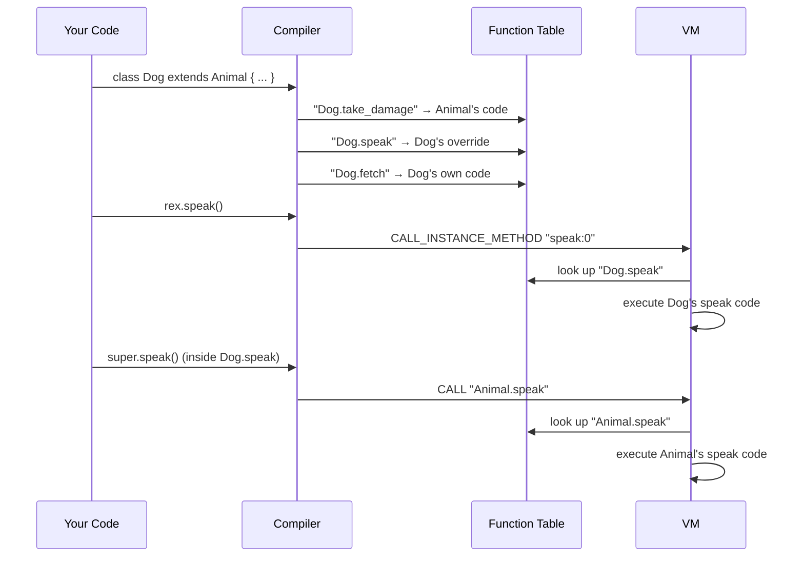

# Inheritance

## Building on What Already Exists

!!! note
    This page builds on [Classes](classes.md). If you haven't read
    that yet, start there first.

Imagine you're designing characters for a video game. Every character
has a **name** and **health points (hp)**. But some characters are
special -- a **Warrior** also has **armor**, and a **Mage** also has
**mana**.

You *could* copy all the shared fields (`name`, `hp`) into every class.
But that means repeating yourself over and over. What if you need to
change how `take_damage` works? You'd have to fix it in every class.

**Inheritance** solves this by letting a class **build on top of**
another class. Think of a family tree:

- An **Animal** has a `name` and can `speak`.
- A **Dog** is a kind of Animal that barks instead of speaking, and
  also has a `breed`.
- A **Puppy** is a kind of Dog that yips instead of barking, and
  also has a `toy`.

Each one extends the last, adding new data and new behaviors. The Dog
doesn't need to re-define `name` -- it inherits it from Animal.

## Defining a Child Class

Use the `extends` keyword after the class name:

```pebble
class Animal {
    name,
    hp,

    fn speak(self) -> String {
        return "I'm " + self.name
    }

    fn take_damage(self, n) {
        self.hp = self.hp - n
    }
}

class Dog extends Animal {
    breed,

    fn fetch(self) -> String {
        return self.name + " fetches!"
    }
}
```

Here, `Dog extends Animal` means "Dog gets everything Animal has, plus
its own stuff." We call Animal the **parent** (or base class) and Dog
the **child** (or derived class).

## Field Inheritance

When a child extends a parent, it inherits **all** the parent's fields.
The child can also add its own new fields. When you create an instance,
you pass the parent's fields **first**, then the child's:

```pebble
let rex = Dog("Rex", 100, "Labrador")
#              ^     ^     ^
#              |     |     └── child field: breed
#              |     └── parent field: hp
#              └── parent field: name

print(rex.name)    # prints: Rex
print(rex.hp)      # prints: 100
print(rex.breed)   # prints: Labrador
```

The child has access to all fields -- both its own and the ones it
inherited.

## Method Inheritance

A child class automatically gets all the parent's methods:

```pebble
rex.take_damage(30)   # inherited from Animal
print(rex.hp)         # prints: 70

print(rex.fetch())    # child's own method
# prints: Rex fetches!
```

You don't have to rewrite `take_damage` -- Dog gets it for free from
Animal.

## Method Overriding

Sometimes the child needs a different version of a parent's method.
Just define a method with the same name:

```pebble
class Dog extends Animal {
    breed,

    fn speak(self) -> String {
        return "Woof! I'm " + self.name
    }

    fn fetch(self) -> String {
        return self.name + " fetches!"
    }
}

let rex = Dog("Rex", 100, "Lab")
print(rex.speak())   # prints: Woof! I'm Rex
print(type(rex))     # prints: Dog
```

Dog's `speak` **overrides** Animal's `speak`. When you call
`rex.speak()`, Pebble uses Dog's version because `rex` is a Dog.
And `type(rex)` returns `"Dog"` -- the child's name, not the parent's.

Note that inheritance only works with **classes**. You can't extend a
struct or an enum -- only a class that has methods.

## The `super` Keyword

What if the child wants to use the parent's version of a method *and*
add to it? That's what `super` is for. Inside a child method, you can
call `super.method()` to run the parent's version:

```pebble
class Dog extends Animal {
    breed,

    fn speak(self) -> String {
        return "Woof! " + super.speak()
    }
}

let rex = Dog("Rex", 100, "Lab")
print(rex.speak())
# prints: Woof! I'm Rex
```

Here's what happens step by step:

1. You call `rex.speak()` -- which runs Dog's `speak`.
2. Dog's `speak` calls `super.speak()` -- which runs Animal's `speak`.
3. Animal's `speak` returns `"I'm Rex"`.
4. Dog's `speak` prepends `"Woof! "` and returns `"Woof! I'm Rex"`.

`super` always calls the **parent class's** version of the method. You
can also pass arguments: `super.method(arg1, arg2)`.

## Multi-Level Chains

Inheritance can go multiple levels deep:

```pebble
class Animal {
    name,
    hp,

    fn speak(self) -> String {
        return "I'm " + self.name
    }
}

class Dog extends Animal {
    breed,

    fn speak(self) -> String {
        return "Woof! " + super.speak()
    }

    fn fetch(self) -> String {
        return self.name + " fetches!"
    }
}

class Puppy extends Dog {
    toy,

    fn speak(self) -> String {
        return "Yip! " + super.speak()
    }

    fn play(self) -> String {
        return self.name + " plays with " + self.toy
    }
}

let p = Puppy("Rex", 100, "Lab", "ball")
print(p.speak())   # prints: Yip! Woof! I'm Rex
print(p.fetch())   # prints: Rex fetches!  (inherited from Dog)
print(p.play())    # prints: Rex plays with ball
```

Notice how `Puppy.speak()` chains through Dog's `speak()` and then
Animal's `speak()` -- each level adds its own prefix. And Puppy can
use `fetch()` which it inherited from Dog, which in turn inherited
`name` from Animal.

## Practical Example: RPG Character Hierarchy

```pebble
class Character {
    name,
    hp,
    level,

    fn take_damage(self, amount) {
        self.hp = self.hp - amount
    }

    fn is_alive(self) -> Bool {
        return self.hp > 0
    }

    fn status(self) -> String {
        return self.name + " (HP: " + str(self.hp) + ")"
    }
}

class Warrior extends Character {
    armor,

    fn take_damage(self, amount) {
        let reduced = amount - self.armor
        if reduced < 0 { reduced = 0 }
        self.hp = self.hp - reduced
    }
}

class Mage extends Character {
    mana,

    fn cast_spell(self, cost) -> String {
        self.mana = self.mana - cost
        return self.name + " casts a spell!"
    }
}

let w = Warrior("Tank", 200, 5, 10)
let m = Mage("Gandalf", 80, 10, 100)

w.take_damage(25)       # only takes 15 (25 - 10 armor)
print(w.status())       # prints: Tank (HP: 185)

print(m.cast_spell(30)) # prints: Gandalf casts a spell!
print(m.is_alive())     # prints: true (inherited from Character)
```

The Warrior overrides `take_damage` to account for armor, while the
Mage adds a new `cast_spell` method. Both inherit `is_alive` and
`status` from Character without rewriting them.

## Error Cases

Pebble catches inheritance mistakes early:

```pebble
# Extending a class that doesn't exist
class Dog extends Unknown { }   # Error: Unknown parent class 'Unknown'

# Extending something that isn't a class
struct Point { x, y }
class Bad extends Point { }     # Error: 'Point' is not a class

# A class can't extend itself
class Loop extends Loop { }     # Error: A class cannot extend itself

# Duplicate field with parent
class Dog extends Animal {
    name                        # Error: Duplicate field 'name'
}                               # (already inherited from Animal)

# Using super outside a child class
class Standalone {
    fn go(self) {
        super.go()              # Error: 'super' can only be used
    }                           # inside a child class
}

# Calling a method the parent doesn't have
class Dog extends Animal {
    fn speak(self) {
        super.fly()             # Error: Parent class 'Animal'
    }                           # has no method 'fly'
}
```

## How It Works Under the Hood

### Compile-Time Resolution

Pebble resolves all inheritance **at compile time**. There's no runtime
lookup of parent classes or method resolution order. The compiler does
the heavy lifting:

1. **Field merging** -- the compiler walks up the parent chain and
   collects every ancestor's fields, prepending them to the child's
   own. So `Dog` stores `["name", "hp", "breed"]` -- the same as if
   you'd written those fields directly.

2. **Method copying** -- inherited methods are registered under the
   child's name. If Animal has `speak`, the compiler creates a
   `"Dog.speak"` entry in the function table pointing to Animal's
   code. If Dog overrides `speak`, it replaces that entry with Dog's
   own version.

3. **super compilation** -- `super.speak()` compiles to a regular
   `CALL` instruction targeting the parent's function (`"Animal.speak"`).
   No special opcode needed.

### No New Opcodes

The existing `CALL` and `CALL_INSTANCE_METHOD` opcodes handle
everything. The compiler pre-populates mangled function names so the
VM doesn't need to know about inheritance at all. Here's the flow:



This design keeps things simple -- the VM just follows function
pointers without caring where they came from.

## What's Next?

You've now seen all three ways to create custom types in Pebble:
[Structs](structs.md) for grouping data, [Classes](classes.md) for
data that can *do things*, and Inheritance for building specialized
classes on top of existing ones. Next up is [Enums](enums.md) -- a
fixed menu of named choices.

## Summary

| Syntax | What it does |
|--------|-------------|
| `class Child extends Parent { }` | Define a child class that inherits from Parent |
| `Child(parent_fields..., child_fields...)` | Create an instance (parent fields first) |
| `child.parent_method()` | Call an inherited method |
| `fn method(self) { }` in child | Override a parent method |
| `super.method()` | Call the parent's version of a method |
| `type(child)` | Returns the child class name (e.g. `"Dog"`) |
