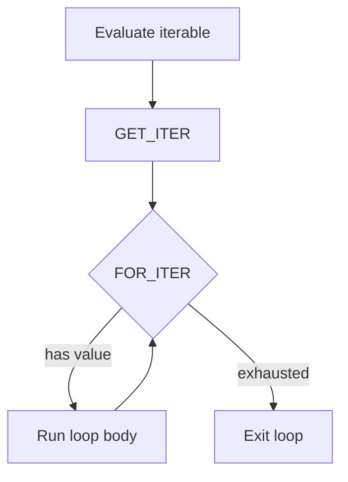
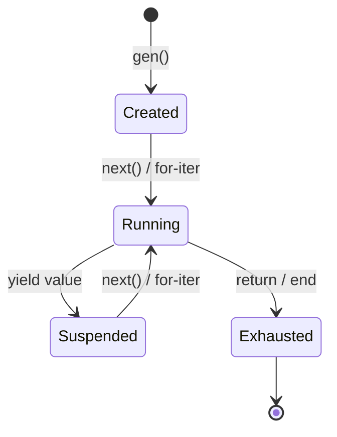

# Iterators & Generators

## The Lazy Assembly Line

!!! note
    This page builds on [Functions](functions.md) and
    [Arrays](arrays.md). If you haven't read those yet, start there
    first.

Imagine a factory with two kinds of assembly lines:

1. **Eager line** -- builds every item at once, puts them all in a big
   box, and hands you the box.
2. **Lazy line** -- builds one item at a time, hands it to you, then
   pauses until you ask for the next one.

Arrays are like the eager line -- all the values exist in memory at
once. **Generators** are like the lazy line -- they produce values one
at a time, only when you ask. This is great when you have millions of
values, or when the sequence might be infinite!

## Iterating Over Lists and Strings

Before generators, Pebble's `for` loops only worked with `range()`.
Now you can loop over **any** list or string directly:

```pebble
for x in [10, 20, 30] {
    print(x)
}
# prints: 10, 20, 30

for ch in "abc" {
    print(ch)
}
# prints: a, b, c
```

The `for` loop asks the list or string for each item, one at a time,
until there are no more.

## Generator Functions

A **generator function** looks just like a regular function, but it
uses `yield` instead of (or in addition to) `return`:

```pebble
fn count_up(n) {
    let i = 0
    while i < n {
        yield i
        i = i + 1
    }
}
```

When you **call** a generator function, it doesn't run the code right
away. Instead, it gives you back a **generator object** -- a paused
assembly line, ready to produce values:

```pebble
let g = count_up(3)
print(type(g))   # prints: generator
```

## The yield Keyword

`yield` is the magic word. When the generator reaches a `yield`:

1. It **pauses** and remembers exactly where it stopped.
2. It **hands back** the yielded value.
3. Next time you ask, it **resumes** right where it left off.

Think of it like a bookmark in a book -- you stop reading, mark your
page, and pick up later from the same spot.

## Advancing with next()

Use `next()` to get the next value from a generator:

```pebble
fn gen() {
    yield 10
    yield 20
    yield 30
}

let g = gen()
print(next(g))   # 10 -- runs until first yield
print(next(g))   # 20 -- resumes after first yield
print(next(g))   # 30 -- resumes after second yield
```

After all the `yield` statements have been reached and the function
ends, the generator is **exhausted**. Calling `next()` again is an
error:

```pebble
next(g)   # Error! Generator is exhausted
```

## For-Loops with Generators

The most common way to use a generator is with a `for` loop. The loop
calls `next()` automatically until the generator is exhausted:

```pebble
fn squares(n) {
    for i in range(n) {
        yield i * i
    }
}

for val in squares(5) {
    print(val)
}
# prints: 0, 1, 4, 9, 16
```

## List Comprehensions with Any Iterable

List comprehensions work with lists, strings, and generators too:

```pebble
let doubled = [x * 2 for x in [1, 2, 3]]
print(doubled)   # [2, 4, 6]

let chars = [ch for ch in "hi"]
print(chars)     # [h, i]

fn gen() { yield 1; yield 2; yield 3 }
let tens = [x * 10 for x in gen()]
print(tens)      # [10, 20, 30]
```

## How It Works Under the Hood

When Pebble sees `for x in something`, it does different things
depending on what `something` is:

### Range (Special Fast Path)

If the iterable is `range()`, the compiler uses the same efficient
counted loop it always has -- no iterator objects needed.

### Lists, Strings, and Generators

For everything else, the compiler emits two new opcodes:

- **GET_ITER** -- converts a list or string into a `SequenceIterator`
  (an object that tracks the current position). Generators are already
  iterators, so they pass through unchanged.
- **FOR_ITER** -- asks the iterator for the next value. If there is
  one, the loop body runs. If the iterator is exhausted, the loop
  ends.



### Generator Lifecycle

When you call a generator function:

1. **Creation** -- Pebble builds a `GeneratorObject` that stores the
   function's code, parameters, and an instruction pointer set to the
   start. No code runs yet.
2. **Advancement** -- Each call to `next()` (or each loop iteration)
   builds a temporary frame from the generator's saved state and runs
   until `yield` or `return`.
3. **Yield** -- The VM saves the frame's state (instruction pointer,
   variables) back into the `GeneratorObject` and pops the frame. The
   yielded value is handed to the caller.
4. **Exhaustion** -- When the function reaches `return` (or falls off
   the end), the generator is marked exhausted. No more values.



## Rules and Restrictions

A few things to keep in mind:

- **yield only in functions** -- You can't use `yield` at the top
  level of a program. It must be inside a `fn`.
- **No yield in try/catch** -- Suspending and resuming inside
  exception handlers is tricky, so Pebble doesn't allow it (yet).
- **Generators are single-use** -- Once exhausted, a generator can't
  be restarted. Call the function again to get a fresh one.
- **No yield from** -- Pebble doesn't support delegating to another
  generator (yet).
- **No yield in async functions** -- `yield` cannot appear inside an
  `async fn`. Async functions use `await` instead. See
  [Async / Await](async.md).

## Practical Example: Fibonacci Generator

Here's a generator that produces Fibonacci numbers forever (well, until
you stop asking):

```pebble
fn fibonacci() {
    let a = 0
    let b = 1
    while true {
        yield a
        let temp = a + b
        a = b
        b = temp
    }
}

# Print the first 10 Fibonacci numbers
let fib = fibonacci()
for i in range(10) {
    print(next(fib))
}
# prints: 0, 1, 1, 2, 3, 5, 8, 13, 21, 34
```

This is the beauty of generators -- the Fibonacci sequence is infinite,
but we only compute as many values as we need!
