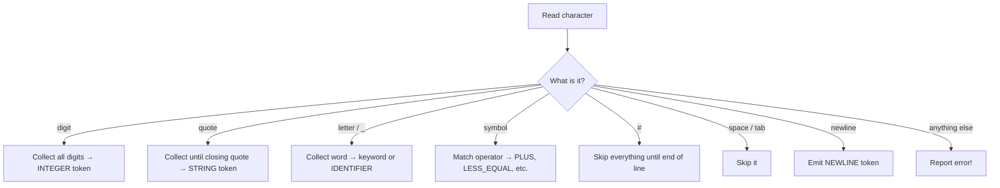

# The Lexer

## What Is a Lexer?

Imagine a **postal worker** at a sorting office. A huge bag of letters arrives
and the worker's job is to read each address and toss the letter into the right
bin: one bin for local deliveries, one for international, one for parcels, and
so on.

A **lexer** (also called a *scanner* or *tokenizer*) does the same thing with
source code. It reads your program one character at a time and sorts the
characters into labelled groups called **tokens**. Once the sorting is done, the
rest of the compiler never has to look at individual characters again -- it
works with tidy, labelled tokens instead.

## How the Pebble Lexer Works

The Pebble lexer is a **single-pass scanner**. That means it walks through your
source code from the first character to the last, exactly once, left to right.
No going back, no second pass. One trip through the mail bag.

Here's what happens at each step:



## A Walk-Through Example

Let's trace what the lexer does with this code:

```
let age = 12
```

| Step | Character(s) | Action | Token produced |
|------|-------------|--------|----------------|
| 1 | `l`, `e`, `t` | Letters → collect word → it's a keyword! | `LET "let"` |
| 2 | ` ` | Space → skip | *(none)* |
| 3 | `a`, `g`, `e` | Letters → collect word → not a keyword | `IDENTIFIER "age"` |
| 4 | ` ` | Space → skip | *(none)* |
| 5 | `=` | Symbol → is the next char `=`? No → assignment | `EQUAL "="` |
| 6 | ` ` | Space → skip | *(none)* |
| 7 | `1`, `2` | Digits → collect all digits | `INTEGER "12"` |
| 8 | *(end)* | Nothing left to read | `EOF ""` |

Notice step 5: the lexer peeks at the *next* character before deciding. If it
saw `==` it would produce an `EQUAL_EQUAL` token instead of `EQUAL`. This
"look-ahead" trick is how it tells `=` (assignment) apart from `==`
(comparison).

## Keeping Track of Position

Every token remembers **where** it came from: the line number and column
number. The lexer keeps a running count:

- **Column** goes up by one for every character
- **Line** goes up by one for every newline, and the column resets to 1

This matters for error messages. If something goes wrong later, the compiler
can say exactly *where* the mistake is in your code.

## What Can Go Wrong?

The lexer catches two kinds of mistakes:

### Unterminated strings

If you open a string with `"` but forget to close it:

```
let name = "Alice
```

The lexer reaches the end of the file while still inside the string and
reports: **"Unterminated string at line 1, column 12"**

### Unexpected characters

If you use a character that Pebble doesn't understand:

```
let x = 5 @ 3
```

The `@` symbol isn't part of Pebble, so the lexer reports:
**"Unexpected character '@' at line 1, column 11"**

## Newline Smarts

Pebble uses newlines to separate statements (instead of semicolons like C or
Java). The lexer does a few clever things with newlines:

1. **Collapse duplicates** -- Three blank lines in a row produce just one
   `NEWLINE` token, not three
2. **Skip leading newlines** -- Blank lines at the very start of a file are
   ignored
3. **Comments are transparent** -- A `# comment` line doesn't produce its own
   token; the newline after it behaves as if the comment wasn't there

## What About Keywords?

When the lexer collects a word (like `let`, `while`, or `myVariable`), it
checks a dictionary called `KEYWORDS`. If the word is in the dictionary, it
gets the keyword's token kind (like `LET` or `WHILE`). If not, it's just a
regular `IDENTIFIER`.

This is why you can't name a variable `let` or `while` -- those words are
*reserved* by the language. But `letter` or `whileLoop` are perfectly fine,
because the lexer only matches *whole* words.

## Summary

| Concept | Analogy |
|---------|---------|
| Lexer | A postal worker sorting mail into labelled bins |
| Token | A letter with its bin label attached |
| Single-pass | One trip through the mail bag, left to right |
| Look-ahead | Peeking at the next letter to decide the bin |
| Source location | The return address on each letter |
