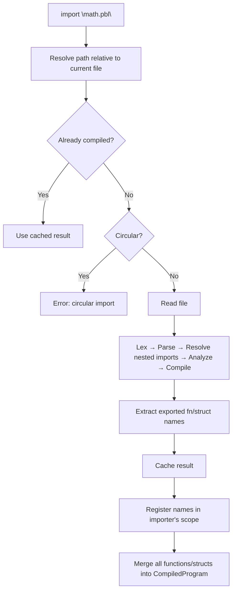

# Modules

## The Sharing Machine

Imagine you and your friends each have a toolbox. Every time you
start a new project, you don't buy a brand-new set of hammers, saws,
and screwdrivers -- you borrow the tools you need from a friend's
toolbox. That way, everyone builds their own tools once, and the
whole group benefits.

A **module** in Pebble is like a friend's toolbox. It's a `.pbl`
file full of functions and structs that you can borrow into your
own program.

## Why Modules?

Without modules, every program would have to contain *everything* it
needs. If you wrote a handy `add` function in one project and wanted
to use it in another, you'd have to copy-paste it. That leads to:

- **Repetition** -- the same code in ten different files.
- **Mistakes** -- fix a bug in one copy but forget the other nine.
- **Messiness** -- one giant file that's hard to read.

Modules solve all three problems. Write it once, import it anywhere.

## Importing Everything

Use `import` followed by a path in quotes:

```pebble
import "math.pbl"

print(add(1, 2))   # 3
```

This brings in *every* function and struct that `math.pbl` defines.
It's the easiest way to grab a whole toolbox at once.

## Importing Specific Names

If you only need a few tools, use `from ... import`:

```pebble
from "math.pbl" import add, multiply

print(add(2, multiply(3, 4)))   # 14
```

Names you don't list stay out of your program. This is like saying
"I only need the hammer and the tape measure, thanks."

## What Gets Imported

Only **definitions** travel between files:

- `fn` function definitions
- `struct` struct definitions

Executable statements like `print(...)`, `let x = ...`, or loops
do **not** run when you import a module. The module's code is read
for its blueprints, not executed line by line.

```pebble
# noisy.pbl
print("I am noisy!")       # this does NOT execute during import
fn quiet() { return 0 }   # this IS available to importers
```

## File Paths

Import paths are **strings** that point to `.pbl` files. They are
resolved relative to the file that contains the `import`:

```pebble
import "math.pbl"           # same directory
import "lib/utils.pbl"      # subdirectory called lib
```

## Creating a Module

Any `.pbl` file is automatically a module. Just write functions and
structs:

```pebble
# geometry.pbl

struct Point { x, y }

fn distance(p) {
    return (p.x ** 2 + p.y ** 2) ** 0.5
}
```

Then another file can import it:

```pebble
import "geometry.pbl"

let p = Point(3, 4)
print(distance(p))   # 5.0
```

## Nested Imports

Modules can import other modules. If `a.pbl` imports `b.pbl`, and
`b.pbl` imports `c.pbl`, everything works automatically:

```pebble
# c.pbl
fn base() { return 1 }

# b.pbl
import "c.pbl"
fn mid() { return base() + 10 }

# a.pbl
import "b.pbl"
fn top() { return mid() + 100 }
```

```pebble
import "a.pbl"
print(top())   # 111
```

Pebble handles the chain for you and never compiles the same module
twice.

## Import Rules

1. **Imports must come first.** All `import` and `from ... import`
   lines must appear at the very top of your file, before any other
   statements.

2. **No circular imports.** If `a.pbl` imports `b.pbl`, then `b.pbl`
   cannot import `a.pbl` (directly or through a chain). Pebble
   detects this and reports an error.

3. **No `export` keyword.** Every top-level `fn` and `struct` is
   automatically available to importers.

4. **Imported names go into your scope.** There are no namespaces
   or prefixes -- `add` from `math.pbl` is just called `add`.

## Error Cases

Pebble catches import problems early:

```
# File not found
import "nonexistent.pbl"
# Error: Module 'nonexistent.pbl' not found

# Circular import
# a.pbl imports b.pbl, b.pbl imports a.pbl
# Error: Circular import detected: 'a.pbl'

# Name not exported
from "math.pbl" import multiply
# Error: Module 'math.pbl' does not export 'multiply'

# Import after code
let x = 1
import "math.pbl"
# Error: Imports must appear at the top of the file
```

## Practical Examples

### Math Library

```pebble
# math.pbl
fn add(a, b) { return a + b }
fn sub(a, b) { return a - b }
fn mul(a, b) { return a * b }
```

```pebble
from "math.pbl" import add, mul
print(add(2, mul(3, 4)))   # 14
```

### Geometry with Structs

```pebble
# geometry.pbl
struct Point { x, y }

fn distance(p) {
    return (p.x ** 2 + p.y ** 2) ** 0.5
}

fn translate(p, dx, dy) {
    return Point(p.x + dx, p.y + dy)
}
```

```pebble
import "geometry.pbl"

let p = Point(3, 4)
print(distance(p))            # 5.0
let moved = translate(p, 1, 1)
print(moved)                   # Point(x=4, y=5)
```

## How It Works Under the Hood

When Pebble sees an `import` statement, here's what happens at
compile time (before any code runs):



The key insight: no new bytecode opcodes are needed. The resolver
compiles each module independently, extracts its function and struct
definitions, and merges them into the importing program's
`CompiledProgram`. At runtime, calling an imported function is
exactly like calling a local one -- the VM doesn't know the
difference.

## Summary

| Syntax | What it does |
| --- | --- |
| `import "path.pbl"` | Bring in all functions and structs from a module |
| `from "path.pbl" import name` | Bring in specific names only |
| `fn` / `struct` in a module | Automatically available to importers |
| `print(...)` in a module | Does NOT execute during import |
| Relative paths | Resolved from the importing file's directory |
| Circular imports | Detected and reported as an error |
| Caching | Each module is compiled at most once |
