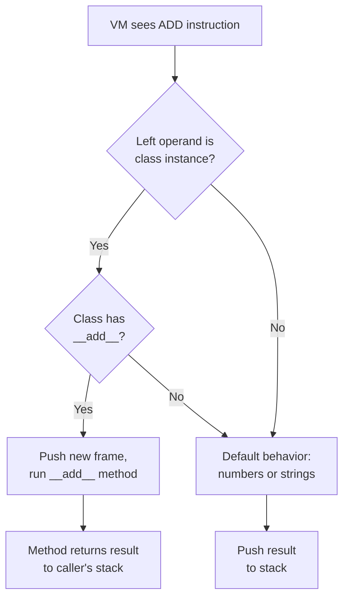

# Operator Overloading

## Teaching Your Robot New Tricks

!!! note
    This page builds on [Classes](classes.md) and
    [Inheritance](inheritance.md). If you haven't read those yet,
    start there first.

In [Classes](classes.md) we built robots -- objects that hold data
*and* know how to do things. But what happens when you try to add two
robots together?

```pebble
class Vector { x, y }
let a = Vector(1, 2)
let b = Vector(3, 4)
let c = a + b   # Error! Pebble doesn't know how to add Vectors
```

Pebble knows how to add numbers and concatenate strings, but it has
no idea what "adding two Vectors" means. **Operator overloading** lets
you teach your class what `+`, `-`, `==`, and other operators should
do. It's like giving your robot an instruction manual for each
operator.

## Dunder Methods

You teach a class about operators by defining **dunder methods** --
methods whose names start and end with double underscores (like
`__add__`). "Dunder" is short for "double underscore."

Each operator has a matching dunder method:

```pebble
class Vector {
    x, y,

    fn __add__(self, other) -> Vector {
        return Vector(self.x + other.x, self.y + other.y)
    }
}

let a = Vector(1, 2)
let b = Vector(3, 4)
let c = a + b
print(c.x)   # prints: 4
print(c.y)   # prints: 6
```

When Pebble sees `a + b` and `a` is a class instance, it checks
whether `a`'s class has an `__add__` method. If it does, Pebble
calls it with `a` as `self` and `b` as `other`. The return value
becomes the result of `a + b`.

## Supported Operators

Here are all the operators you can overload:

### Arithmetic Operators

| Operator | Dunder Method | Example |
|----------|--------------|---------|
| `+` | `__add__(self, other)` | `a + b` |
| `-` | `__sub__(self, other)` | `a - b` |
| `*` | `__mul__(self, other)` | `a * b` |
| `/` | `__div__(self, other)` | `a / b` |
| `//` | `__floordiv__(self, other)` | `a // b` |
| `%` | `__mod__(self, other)` | `a % b` |
| `**` | `__pow__(self, other)` | `a ** b` |

### Comparison Operators

| Operator | Dunder Method | Example |
|----------|--------------|---------|
| `==` | `__eq__(self, other)` | `a == b` |
| `!=` | `__ne__(self, other)` | `a != b` |
| `<` | `__lt__(self, other)` | `a < b` |
| `<=` | `__le__(self, other)` | `a <= b` |
| `>` | `__gt__(self, other)` | `a > b` |
| `>=` | `__ge__(self, other)` | `a >= b` |

### Unary Operators

| Operator | Dunder Method | Example |
|----------|--------------|---------|
| `-` (negation) | `__neg__(self)` | `-a` |

### String Representation

| Context | Dunder Method | Example |
|---------|--------------|---------|
| `print()`, `str()`, `"{a}"` | `__str__(self)` | `print(a)` |

## A Complete Example

Here's a `Vector` class with arithmetic, comparison, negation, and
string display:

```pebble
class Vector {
    x, y,

    fn __add__(self, other) -> Vector {
        return Vector(self.x + other.x, self.y + other.y)
    }

    fn __sub__(self, other) -> Vector {
        return Vector(self.x - other.x, self.y - other.y)
    }

    fn __eq__(self, other) -> Bool {
        return self.x == other.x and self.y == other.y
    }

    fn __neg__(self) -> Vector {
        return Vector(0 - self.x, 0 - self.y)
    }

    fn __str__(self) -> String {
        return "(" + str(self.x) + ", " + str(self.y) + ")"
    }
}

let a = Vector(1, 2)
let b = Vector(3, 4)

print(a + b)     # prints: (4, 6)
print(a - b)     # prints: (-2, -2)
print(a == b)    # prints: false
print(-a)        # prints: (-1, -2)
print("v = {a}") # prints: v = (1, 2)
```

## Custom String Display with `__str__`

When you define `__str__`, it's used everywhere Pebble needs to turn
your object into text:

- **`print(a)`** -- uses `__str__` to display the value
- **`str(a)`** -- uses `__str__` to convert to a string
- **`"value: {a}"`** -- uses `__str__` inside string interpolation

Without `__str__`, Pebble uses the default format that shows the class
name and all fields:

```pebble
class Point { x, y }
let p = Point(3, 4)
print(p)   # prints: Point(x=3, y=4)
```

With `__str__`, you control the display:

```pebble
class Point {
    x, y,

    fn __str__(self) -> String {
        return "(" + str(self.x) + ", " + str(self.y) + ")"
    }
}

let p = Point(3, 4)
print(p)   # prints: (3, 4)
```

## Chaining Operators

Operators work with chaining, just like regular math:

```pebble
let a = Vector(1, 0)
let b = Vector(0, 1)
let c = Vector(2, 2)
let result = a + b + c
print(result)   # prints: (3, 3)
```

Pebble evaluates this left to right: first `a + b` gives
`Vector(1, 1)`, then `Vector(1, 1) + c` gives `Vector(3, 3)`.

## Operator Overloading with Inheritance

Dunder methods work with inheritance just like regular methods:

- A **child class inherits** parent dunders automatically
- A child can **override** a parent's dunder
- A child can call **`super.__add__()`** to use the parent's version

```pebble
class Base {
    val,

    fn __add__(self, other) -> Base {
        return Base(self.val + other.val)
    }

    fn __str__(self) -> String {
        return "Base(" + str(self.val) + ")"
    }
}

class Fancy extends Base {
    fn __add__(self, other) -> Fancy {
        return Fancy(self.val + other.val + 100)
    }

    fn __str__(self) -> String {
        return "Fancy(" + str(self.val) + ")"
    }
}

let a = Fancy(10)
let b = Fancy(20)
print(a + b)   # prints: Fancy(130)
```

## Without an Operator: What Happens?

If you use an operator on a class that doesn't define the matching
dunder:

- **Arithmetic** (`+`, `-`, `*`, etc.): You get a type error
- **`==` and `!=`**: Falls through to default comparison (structural
  equality -- two instances with the same fields are equal)
- **Ordering** (`<`, `<=`, `>`, `>=`): You get a type error
- **`-` (negation)**: You get a type error

```pebble
class Plain { val }
let a = Plain(1)
let b = Plain(2)
let c = a + b   # Error: Unsupported operand types for +
```

## Error Cases

Pebble catches dunder mistakes at compile time:

```pebble
# Binary dunder with wrong number of parameters
class Bad {
    val,
    fn __add__(self) { }   # Error: requires 2 parameters, got 1
}

# Unary dunder with wrong number of parameters
class Bad {
    val,
    fn __neg__(self, other) { }   # Error: requires 1 parameter, got 2
}
```

## Practical Example: Money

Here's a `Money` class that handles arithmetic and display:

```pebble
class Money {
    cents,

    fn __add__(self, other) -> Money {
        return Money(self.cents + other.cents)
    }

    fn __sub__(self, other) -> Money {
        return Money(self.cents - other.cents)
    }

    fn __mul__(self, other) -> Money {
        return Money(self.cents * other)
    }

    fn __eq__(self, other) -> Bool {
        return self.cents == other.cents
    }

    fn __lt__(self, other) -> Bool {
        return self.cents < other.cents
    }

    fn __str__(self) -> String {
        let dollars = self.cents // 100
        let remaining = self.cents % 100
        return "$" + str(dollars) + "." + str(remaining)
    }
}

let price = Money(1299)     # $12.99
let tax = Money(104)        # $1.04
let total = price + tax
print(total)                # prints: $14.3
print(price == tax)         # prints: false
print(tax < price)          # prints: true
```

## How It Works Under the Hood

### No New Syntax or Opcodes

Dunder methods are just regular methods with double-underscore names.
The parser and compiler don't need any changes -- `fn __add__(self,
other) { ... }` is already valid syntax because underscores are
allowed in identifiers.

Operators still compile to the same opcodes (`ADD`, `SUBTRACT`, etc.).
The magic happens at **runtime in the VM**.

### VM Dispatch

When the VM executes an operator like `ADD`:

1. Pop both operands from the stack
2. Check if the left operand is a class instance
3. If yes, look for the corresponding dunder method (e.g. `__add__`)
4. If found, push a new frame and execute the dunder method
5. The method's `RETURN` pushes the result back onto the stack
6. If no dunder found, fall through to the default behavior (numbers,
   strings, or type error)



### `__str__` is Special

For `__str__`, the VM uses **synchronous dispatch** -- it runs the
method immediately and waits for the result. This is because `print`,
`str()`, and string interpolation all need the string value right away
to continue working.

## What's Next?

You've now seen how to teach your classes to understand operators.
Next up is [Iterators & Generators](iterators.md) -- a way to produce
values one at a time, like dealing cards from a deck.

## Summary

| Concept | What it does |
|---------|-------------|
| `fn __add__(self, other) { }` | Define custom `+` behavior |
| `fn __neg__(self) { }` | Define custom unary `-` behavior |
| `fn __eq__(self, other) { }` | Define custom `==` behavior |
| `fn __str__(self) { }` | Define custom string display |
| Dunder + inheritance | Child classes inherit and can override dunders |
| Arity validation | Pebble checks dunder param counts at compile time |
