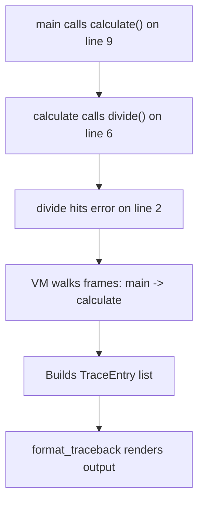

# Stack Traces

## Following the Breadcrumb Trail

Imagine you're exploring a maze. At every turn, you drop a breadcrumb so
you can trace your path back to the entrance. If you get stuck, you can
look at the trail of breadcrumbs and see exactly how you got there.

Stack traces work the same way. When your program calls a function, the
computer drops a "breadcrumb" -- it remembers *where* the call happened.
If something goes wrong deep inside a chain of function calls, those
breadcrumbs tell you the full path the program took to reach the error.

## What a Stack Trace Looks Like

Here's a program with a bug hiding inside nested function calls:

```pebble
fn divide(a, b) {
  return a / b
}

fn calculate() {
  divide(10, 0)
}

calculate()
```

When you run this, Pebble shows:

```
Traceback (most recent call last):
  line 9, in <main>
  line 6, in calculate
Error: Division by zero at line 2, column 12
```

Reading from top to bottom:

1. **line 9, in `<main>`** -- the program started here, calling `calculate()`.
2. **line 6, in `calculate`** -- inside `calculate`, it called `divide(10, 0)`.
3. **Error** -- inside `divide`, division by zero happened at line 2.

The trace reads like a story: "I was on line 9 of the main program,
which called `calculate` on line 6, which hit a division-by-zero error
on line 2."

## Why Stack Traces Matter

Without a stack trace, you'd only see:

```
Error: Division by zero at line 2, column 12
```

That tells you *what* went wrong and *where* the error happened, but not
*how the program got there*. If `divide` is called from ten different
places, you wouldn't know which call caused the problem.

The stack trace answers the question: **"What was the program doing when
things went wrong?"**

## Deeper Call Chains

The more functions involved, the longer the trace:

```pebble
fn step_one() {
  let x = 1 / 0
}

fn step_two() {
  step_one()
}

fn step_three() {
  step_two()
}

step_three()
```

```
Traceback (most recent call last):
  line 13, in <main>
  line 10, in step_three
  line 6, in step_two
Error: Division by zero at line 2, column 13
```

Each line in the trace is one "breadcrumb" -- one function call that
led to the next, all the way down to the error.

## Try/Catch and Stack Traces

When you catch an error with `try/catch`, the stack trace doesn't
appear -- because the error was *handled*. The program keeps running:

```pebble
fn risky() {
  let x = 1 / 0
}

try {
  risky()
} catch e {
  print("Caught: {e}")
}
```

Output: `Caught: Division by zero`

No stack trace, because the `catch` block dealt with the problem.
Stack traces only appear for **uncaught** errors -- ones that nobody
handled.

## Using the Debugger

The debugger's `bt` (backtrace) command shows you the call stack
*while the program is running*, with line numbers for each frame:

```
(pdb) bt
  > inner (line 2)
    outer (line 5)
    <main> (line 8)
```

The `>` arrow marks the frame you're currently in. This is handy for
understanding where you are when stepping through code.

## How It Works Under the Hood

Every time Pebble calls a function, the VM pushes a **frame** onto the
call stack. Each frame remembers:

- Which function it belongs to (the function name).
- Which instruction it was about to execute (the instruction pointer).
- The local variables for that call.

When an error happens, the VM walks the call stack from bottom to top.
For each frame, it looks at the instruction that made the call and reads
its source location (line and column). It packs all of these into a list
of **TraceEntry** objects and attaches them to the error.

The `format_traceback` function then turns that list into the
human-readable output you see on screen.



## Summary

| Concept | What It Means |
|---------|--------------|
| Stack trace | The chain of function calls that led to an error |
| Frame | One "breadcrumb" -- a function call with its line number |
| `<main>` | The top-level program (not inside any function) |
| Traceback | Pebble's name for the stack trace in the error output |
| `bt` command | Debugger command to see the call stack while running |
