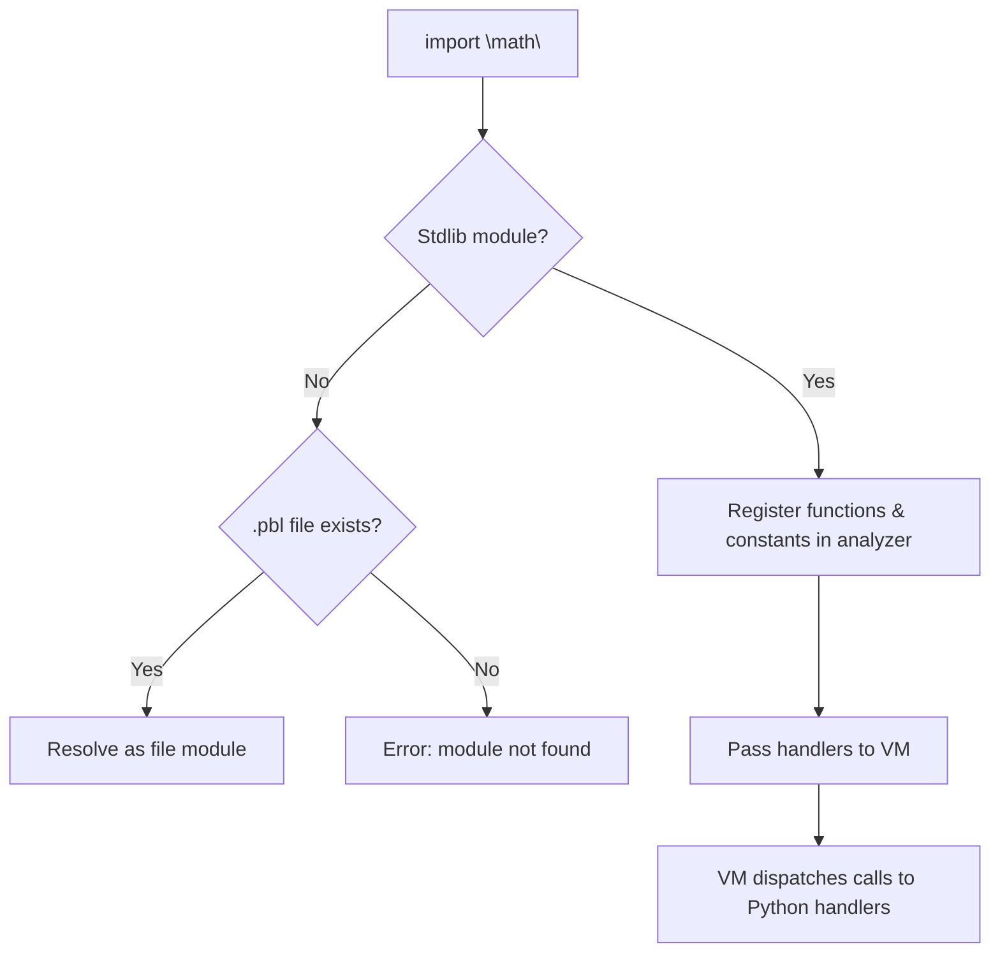

# Standard Library

Pebble's standard library has two layers:

1. **Built-in functions** — always available, no import needed (`print`,
   `len`, `type`, etc.)
2. **Importable modules** — extra tools you bring in with `import "math"`
   or `import "io"`

This page covers both.

---

## Part 1: Built-in Functions

These functions are always available. You don't need to import anything —
they're ready to use the moment your program starts.

## print(value)

Display a value on screen. Every Pebble type is automatically converted to
text:

```pebble
print(42)              # prints: 42
print("hello")         # prints: hello
print(true)            # prints: true
print([1, 2, 3])       # prints: [1, 2, 3]
print({"a": 1})        # prints: {a: 1}
```

`print()` always adds a newline at the end.

## range(...)

Generate a sequence of numbers for a `for` loop. There are three ways to
call it:

### range(stop)

Count from `0` up to (but **not** including) `stop`:

```pebble
for i in range(4) {
    print(i)
}
# prints: 0, 1, 2, 3 (each on its own line)
```

Think of `range(4)` as saying "count from 0 up to 3".

### range(start, stop)

Count from `start` up to (but **not** including) `stop`:

```pebble
for i in range(2, 5) {
    print(i)
}
# prints: 2, 3, 4
```

If `start` equals `stop`, the loop body never runs.

### range(start, stop, step)

Count from `start` toward `stop`, adding `step` each time:

```pebble
for i in range(0, 10, 2) {
    print(i)
}
# prints: 0, 2, 4, 6, 8
```

The `step` can be **negative** to count backwards:

```pebble
for i in range(5, 0, -1) {
    print(i)
}
# prints: 5, 4, 3, 2, 1
```

If the step goes the wrong direction (e.g. `range(0, 5, -1)`), the loop
body never runs — there's nothing to count through.

!!! note
    `range()` can only be used inside a `for` loop or a
    [list comprehension](list-comprehensions.md). The compiler translates
    `for i in range(...)` into a counting while-loop behind the scenes.

## str(value)

Convert any value to its text form:

```pebble
print(str(42))      # prints: 42
print(str(true))    # prints: true
print(str([1, 2]))  # prints: [1, 2]
```

This is the same conversion that happens automatically inside `{…}` string
interpolation.

## int(value)

Convert a value to a whole number. Works with strings, floats, and integers:

```pebble
let age = int("12")
print(age + 1)   # prints: 13
```

When converting a float, `int()` **truncates** toward zero (chops off the
decimal part):

```pebble
print(int(3.7))    # prints: 3
print(int(-2.9))   # prints: -2
```

If the string doesn't look like a number, Pebble stops with an error:

```pebble
int("hello")   # Error: Cannot convert 'hello' to int
```

Passing an integer to `int()` gives back the same number (handy if you're
not sure what type you have):

```pebble
print(int(42))   # prints: 42
```

## float(value)

Convert a value to a decimal number. Works with integers and strings:

```pebble
print(float(42))       # prints: 42.0
print(float("3.14"))   # prints: 3.14
print(float(1.5))      # prints: 1.5
```

If the string doesn't look like a number, Pebble stops with an error:

```pebble
float("hello")   # Error: Cannot convert 'hello' to float
```

## type(value)

Find out what kind of value something is:

```pebble
print(type(42))        # prints: int
print(type(3.14))      # prints: float
print(type("hello"))   # prints: str
print(type(true))      # prints: bool
print(type([1, 2]))    # prints: list
print(type({}))        # prints: dict
```

The result is always a string like `"int"`, `"float"`, `"str"`, `"bool"`,
`"null"`, `"list"`, `"dict"`, or `"fn"`. For [structs](structs.md), it
returns the struct's name:

```pebble
struct Point { x, y }
let p = Point(10, 20)
print(type(p))         # prints: Point
```

You can use it in conditions:

```pebble
let x = 42
if type(x) == "int" {
    print("it is a number")
}
```

## len(value)

Count the number of items in a list or dict, or characters in a string:

```pebble
print(len([10, 20, 30]))       # prints: 3
print(len("hello"))             # prints: 5
print(len({"a": 1, "b": 2}))  # prints: 2
print(len([]))                  # prints: 0
```

## push(list, value)

Add a value to the **end** of a list. This changes the list itself (it
doesn't create a new one):

```pebble
let xs = [1, 2, 3]
push(xs, 4)
print(xs)   # prints: [1, 2, 3, 4]
```

Think of it like adding another person to the back of a queue.

!!! note
    You can also write `xs.push(4)` using method syntax — see
    [Arrays](arrays.md#push).

## pop(list)

Remove and give back the **last** value from a list:

```pebble
let xs = [1, 2, 3]
let last = pop(xs)
print(last)   # prints: 3
print(xs)     # prints: [1, 2]
```

If the list is empty, Pebble stops with an error — you can't take something
from an empty container.

!!! note
    You can also write `xs.pop()` using method syntax — see
    [Arrays](arrays.md#pop).

## keys(dict)

Return a list of all the keys in a dictionary, in the order they were added:

```pebble
let d = {"name": "Alice", "age": 12}
print(keys(d))   # prints: [name, age]
```

If the dictionary is empty, you get an empty list:

```pebble
print(keys({}))   # prints: []
```

## values(dict)

Return a list of all the values in a dictionary, in the order they were added:

```pebble
let d = {"name": "Alice", "age": 12}
print(values(d))   # prints: [Alice, 12]
```

If the dictionary is empty, you get an empty list:

```pebble
print(values({}))   # prints: []
```

## map(fn, list)

Apply a function to every element and return a new list of results. The first
argument can be a named function or an anonymous function (`fn(...) { ... }`):

```pebble
fn double(x) { return x * 2 }
print(map(double, [1, 2, 3]))   # prints: [2, 4, 6]
```

You can also use an anonymous function:

```pebble
print(map(fn(x) { return x + 10 }, [1, 2, 3]))   # prints: [11, 12, 13]
```

See [Higher-Order Functions](higher-order.md) for more details.

## filter(fn, list)

Keep only the elements where the function returns `true`:

```pebble
fn is_even(x) { return x % 2 == 0 }
print(filter(is_even, [1, 2, 3, 4]))   # prints: [2, 4]
```

See [Higher-Order Functions](higher-order.md) for more details.

## reduce(fn, list, initial)

Combine all elements into a single value using a function and a starting
value:

```pebble
fn add(a, b) { return a + b }
print(reduce(add, [1, 2, 3], 0))   # prints: 6
```

See [Higher-Order Functions](higher-order.md) for more details.

## next(generator)

Get the next value from a generator (a function that uses `yield`):

```pebble
fn count_up() {
    yield 1
    yield 2
    yield 3
}

let g = count_up()
print(next(g))   # prints: 1
print(next(g))   # prints: 2
print(next(g))   # prints: 3
```

If the generator has no more values, Pebble stops with an error.

See [Iterators & Generators](iterators.md) for more details.

## async_run(coroutine)

Start the event loop and run an async function to completion:

```pebble
async fn greet() {
    return "hello"
}

let result = async_run(greet())
print(result)   # prints: hello
```

## spawn(coroutine)

Register a coroutine as a background task with the event loop. Returns a
handle you can `await` later:

```pebble
async fn task() {
    await sleep(1)
    return 42
}

async fn main() {
    let h = spawn(task())
    let result = await h
    print(result)   # prints: 42
}

async_run(main())
```

## sleep(ticks)

Pause the current async task for a number of ticks. While one task
sleeps, the event loop runs other tasks:

```pebble
async fn countdown(n) {
    let i = n
    while i > 0 {
        print(i)
        await sleep(1)
        i = i - 1
    }
}

async_run(countdown(3))   # prints: 3, 2, 1
```

See [Async / Await](async.md) for more details on all three.

## Putting It All Together

You can combine these to do useful things. Here's a program that builds a
list dynamically:

```pebble
let numbers = []
for i in range(5) {
    push(numbers, i * i)
}
print(numbers)   # prints: [0, 1, 4, 9, 16]
```

And here's a simple stack (last-in, first-out):

```pebble
let stack = []
push(stack, "first")
push(stack, "second")
push(stack, "third")

let top = pop(stack)
print("popped: {top}")         # prints: popped: third
print("size: {len(stack)}")    # prints: size: 2
```

## How Built-ins Work Under the Hood

Every built-in function lives in a Python module called `builtins.py`. It
holds a dictionary mapping each function's name to two things:

1. **Arity** — how many arguments the function expects (so the analyzer can
   check you passed the right number).
2. **Handler** — the Python function that actually does the work.

When the VM encounters a `CALL` instruction, it checks this dictionary
first. If the name matches a builtin, it pops the arguments off the stack,
calls the handler, and pushes the result back. If there's no match, it
looks for a user-defined function instead.

Think of it like a restaurant kitchen. The built-in functions are the dishes
already on the menu — the chef knows how to make them without a recipe card.
Your own functions are custom orders that need their own recipe (a
`CodeObject`).

---

## Part 2: Importable Modules

Some functions aren't needed in every program. Instead of making them
always available, Pebble puts them in **modules** you can import when you
need them. Think of these as specialist toolboxes — you only grab the
maths toolbox when you're doing calculations.

Unlike [file modules](modules.md) (which are `.pbl` files you write
yourself), these are **built-in** modules that come with Pebble. You
import them the same way, but you don't need any `.pbl` file on disk.

### The `math` Module

Import it with:

```pebble
import "math"
```

Or grab just the functions you need:

```pebble
from "math" import sqrt, pi
```

#### Constants

| Name | Value | Description |
| ---- | ----- | ----------- |
| `pi` | 3.141592653589793 | The ratio of a circle's circumference to its diameter |
| `e` | 2.718281828459045 | The base of the natural logarithm |

Constants are just values — use them without parentheses:

```pebble
import "math"
print(pi)   # prints: 3.141592653589793
print(e)    # prints: 2.718281828459045
```

#### Functions

| Function | Description |
| -------- | ----------- |
| `abs(x)` | Absolute value (distance from zero) |
| `min(a, b)` | The smaller of two values |
| `max(a, b)` | The larger of two values |
| `floor(x)` | Round down to the nearest whole number |
| `ceil(x)` | Round up to the nearest whole number |
| `round(x)` | Round to the nearest whole number |
| `sqrt(x)` | Square root |
| `pow(x, y)` | Raise `x` to the power `y` |
| `sin(x)` | Sine (input in radians) |
| `cos(x)` | Cosine (input in radians) |
| `log(x)` | Natural logarithm (base *e*) |

```pebble
import "math"

print(abs(-7))       # prints: 7
print(min(3, 8))     # prints: 3
print(max(3, 8))     # prints: 8
print(floor(3.9))    # prints: 3
print(ceil(3.1))     # prints: 4
print(round(3.5))    # prints: 4
print(sqrt(16))      # prints: 4.0
print(pow(2, 10))    # prints: 1024
```

!!! tip
    `abs`, `min`, and `max` work with both integers and floats.

### The `io` Module

The `io` module gives you one function — `input()` — for reading text
from the user's keyboard.

```pebble
import "io"

let name = input("What is your name? ")
print("Hello, " + name)
```

Running this program shows:

```
What is your name? Alice
Hello, Alice
```

You can also call `input()` with no argument:

```pebble
import "io"

let line = input()
print("You typed: " + line)
```

!!! note
    `input()` always returns a **string**. If you need a number, wrap it
    with `int()` or `float()`:

    ```pebble
    import "io"
    let age = int(input("How old are you? "))
    print(age + 1)
    ```

### Selective Imports

Just like with file modules, you can import only the names you need:

```pebble
from "math" import sqrt, pi

let radius = 5
let area = pi * radius * radius
print(area)         # prints: 78.53981633974483
print(sqrt(area))   # prints: 8.862269254527579
```

Names you didn't import are not available:

```pebble
from "math" import sqrt
print(cos(0))   # Error: 'cos' is not defined
```

### Error Cases

```
# Unknown module (no .pbl file either)
import "graphics"
# Error: Module 'graphics' not found

# Unknown name in a known module
from "math" import tangent
# Error: Module 'math' does not export 'tangent'

# Wrong argument count
import "math"
sqrt(1, 2)
# Error: Function 'sqrt' expects 1 argument but got 2
```

### How Importable Modules Work Under the Hood

The resolver — the same component that handles `import "file.pbl"` —
checks whether the import path matches a known **stdlib module name**
before looking for a `.pbl` file on disk.



Each stdlib function is a small Python function inside `stdlib.py`.
When the VM encounters a call to `sqrt`, it looks in its stdlib handler
table, pops the argument off the stack, calls the Python function, and
pushes the result back. Constants like `pi` are simply injected into
the VM's global variables at startup — no function call needed.

## Summary

| Category | Examples | Import needed? |
| -------- | -------- | -------------- |
| Built-in functions | `print`, `len`, `type`, `range` | No |
| `math` module | `sqrt`, `pi`, `abs`, `floor` | `import "math"` |
| `io` module | `input` | `import "io"` |
