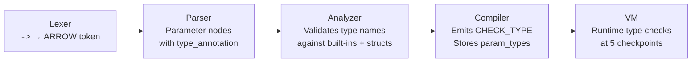

# Type Annotations

## The Label System

Imagine you're packing boxes for a move. You could just throw everything in
randomly -- but if you write "BOOKS" on one box and "DISHES" on another,
you'll know exactly what's inside without opening them. More importantly,
you (or a helpful friend) can stop someone from putting a heavy lamp in the
"DISHES" box where it might break something.

**Type annotations** in Pebble work the same way. You can put labels on
your variables, function parameters, return values, and struct fields that
say what kind of value belongs there. Pebble checks the labels at runtime
and stops the program if someone puts the wrong thing in the wrong box.

## Why Type Annotations?

Two big reasons:

1. **Catch mistakes earlier.** Without annotations, a wrong value might
   travel through your code and cause a confusing error far from where the
   mistake actually happened. With annotations, Pebble catches the problem
   right at the source.

2. **Clearer code.** Reading `fn add(a: Int, b: Int) -> Int` tells you
   immediately that this function takes two integers and gives back an
   integer. No guessing.

## The Basic Types

Pebble has seven built-in type names you can use in annotations:

| Annotation | What it means                  | Example value    |
|------------|-------------------------------|------------------|
| `Int`      | A whole number                | `42`, `-7`       |
| `Float`    | A number with a decimal point | `3.14`, `1.0`    |
| `String`   | A piece of text               | `"hello"`        |
| `Bool`     | True or false                 | `true`, `false`  |
| `List`     | An ordered collection         | `[1, 2, 3]`      |
| `Dict`     | Key-value pairs               | `{"a": 1}`       |
| `Fn`       | A function or closure         | `fn(x) { x * 2 }` |

You can also use any struct name you've defined (like `Point` or `Circle`).

!!! note
    The annotation names use capital letters (`Int`, `String`) while the
    `type()` function returns lowercase (`int`, `str`). The annotations are
    for *your* labels; `type()` shows the internal name.

## Annotating Variables

Add a colon and a type name after the variable name:

```pebble
let x: Int = 5
const pi: Float = 3.14
let name: String = "Alice"
```

If you leave off the annotation, the variable accepts any value -- exactly
like before:

```pebble
let anything = 42      # no annotation, any value is fine
```

## Annotating Function Parameters

Put `: Type` after each parameter name:

```pebble
fn add(a: Int, b: Int) {
    return a + b
}
```

You can mix annotated and unannotated parameters -- only the annotated ones
are checked:

```pebble
fn greet(name: String, times) {
    for i in range(times) {
        print("Hello {name}")
    }
}
```

## Annotating Return Types

Use `->` after the closing parenthesis to say what a function gives back:

```pebble
fn square(x: Int) -> Int {
    return x * x
}
```

If the function has a return type annotation, Pebble checks every `return`
statement (and the implicit return at the end) to make sure the value
matches.

## Annotating Struct Fields

Add `: Type` after each field name inside the struct definition:

```pebble
struct Point {
    x: Float,
    y: Float
}
```

Now Pebble checks the types both when you **create** an instance and when
you **change** a field:

```pebble
let p = Point(1.0, 2.0)    # OK -- both are Float
p.x = 3.0                  # OK -- Float into a Float field
```

You can mix typed and untyped fields -- only the annotated ones are checked:

```pebble
struct Config {
    name: String,
    value           # accepts anything
}
```

## When Types Are Checked

Pebble checks type annotations **at runtime** -- that means the program
actually runs and checks each value as it flows through. Here are the five
checkpoints:

1. **Variable assignment** -- when `let x: Int = ...` runs, the value is
   checked.
2. **Function parameters** -- when you call `add(1, 2)`, each argument is
   checked against the parameter's annotation.
3. **Function return** -- when `return value` runs, the value is checked
   against the `->` annotation.
4. **Struct construction** -- when you write `Point(1.0, 2.0)`, each
   argument is checked against the field's annotation.
5. **Struct field assignment** -- when you write `p.x = 3.0`, the new
   value is checked.

## Mixing Typed and Untyped

Annotations are **completely optional**. You can add them to some things
and not others -- this is called **gradual typing**. Unannotated code works
exactly like it always has:

```pebble
# Fully typed
fn add(a: Int, b: Int) -> Int {
    return a + b
}

# Fully untyped -- still works perfectly
fn multiply(a, b) {
    return a * b
}

# Mixed -- only 'name' is checked
fn greet(name: String, times) {
    for i in range(times) {
        print("Hello {name}")
    }
}
```

## Using Struct Types

You can use a struct's name as a type annotation:

```pebble
struct Point { x: Float, y: Float }

let origin: Point = Point(0.0, 0.0)

fn distance(p: Point) -> Float {
    return (p.x ** 2 + p.y ** 2) ** 0.5
}
```

A struct can even reference itself in its field types:

```pebble
struct Node {
    value: Int,
    label         # untyped -- could hold another Node or anything
}
```

## Error Messages

When a type check fails, Pebble gives you a clear error message:

```
Type error: expected Int, got String
```

For function parameters, it names the parameter:

```
Type error: parameter 'age' expected Int, got String
```

For struct fields, it names both the field and the struct:

```
Type error: field 'x' of 'Point' expected Float, got Int
```

## Practical Examples

### A Simple Calculator

```pebble
fn calculate(a: Float, b: Float, op: String) -> Float {
    match op {
        case "+" { return a + b }
        case "-" { return a - b }
        case "*" { return a * b }
        case "/" { return a / b }
    }
    return 0.0
}

print(calculate(10.0, 3.0, "+"))   # 13.0
```

### A User Record

```pebble
struct User {
    name: String,
    age: Int
}

fn describe(u: User) -> String {
    return "{u.name} is {u.age} years old"
}

let alice: User = User("Alice", 12)
print(describe(alice))   # Alice is 12 years old
```

## How It Works Under the Hood

The type annotation system touches every stage of the compiler pipeline:



1. **Lexer** -- The `->` symbol produces a new `ARROW` token.
2. **Parser** -- Parameters and fields become `Parameter` nodes with an
   optional `type_annotation`. Return types are parsed after `->`.
3. **Analyzer** -- Each type name is validated: it must be a built-in type
   (`Int`, `Float`, etc.) or a defined struct name.
4. **Compiler** -- For annotated variables and returns, the compiler emits
   a `CHECK_TYPE` instruction. Function metadata (`param_types`,
   `return_type`) and struct field types are stored alongside the bytecode.
5. **VM** -- At runtime, `CHECK_TYPE` peeks at the value on the stack and
   validates its type. Parameter and field checks happen at call time and
   construction time.

## Summary

| Concept | Syntax | Example |
|---------|--------|---------|
| Variable type | `let name: Type = value` | `let x: Int = 5` |
| Const type | `const name: Type = value` | `const pi: Float = 3.14` |
| Parameter type | `fn f(name: Type)` | `fn f(x: Int)` |
| Return type | `fn f() -> Type` | `fn f() -> Int` |
| Struct field type | `struct S { field: Type }` | `struct S { x: Float }` |
| All annotations optional | Omit `: Type` or `-> Type` | `let x = 5` |
| Struct as type | Use the struct's name | `let p: Point = ...` |
