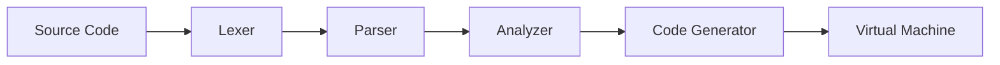

# What Is a Compiler?

Imagine you only speak English, and you need to give instructions to a robot
that only understands a list of numbered steps. You'd need a **translator** who
can read your English sentences and convert them into the robot's numbered
instructions. That translator is a **compiler**.

## The Pebble Language

**Pebble** is a small programming language designed for learning. It's simple
enough to understand completely, but powerful enough to do real things:
calculate numbers, make decisions, repeat actions, and organise code into
reusable functions.

Here's what Pebble code looks like:

```
let greeting = "Hello, world!"
print(greeting)

let count = 0
while count < 5 {
    print(count)
    count = count + 1
}
```

## How a Compiler Works

A compiler reads your code and transforms it through several stages, like an
assembly line in a factory:



1. **Lexer** -- Breaks the text into small pieces called *tokens* (like
   splitting a sentence into words)
2. **Parser** -- Arranges the tokens into a tree structure that shows how they
   relate to each other (like diagramming a sentence)
3. **Analyzer** -- Checks the tree for mistakes (like a teacher proofreading
   your essay)
4. **Code Generator** -- Translates the tree into simple numbered instructions
   called *bytecode* (like writing a recipe as step-by-step directions)
5. **Virtual Machine** -- Follows the instructions one by one and produces the
   result (like a cook following a recipe)

## Why Build a Compiler?

Building a compiler teaches you how programming languages *actually work*.
Every time you write Python, JavaScript, or any other language, a compiler or
interpreter is doing these same steps behind the scenes. By building one
yourself, you peek behind the curtain and see the magic trick explained.

Think of it like learning to cook instead of just ordering food -- once you
know how it works, you understand it on a completely different level.
